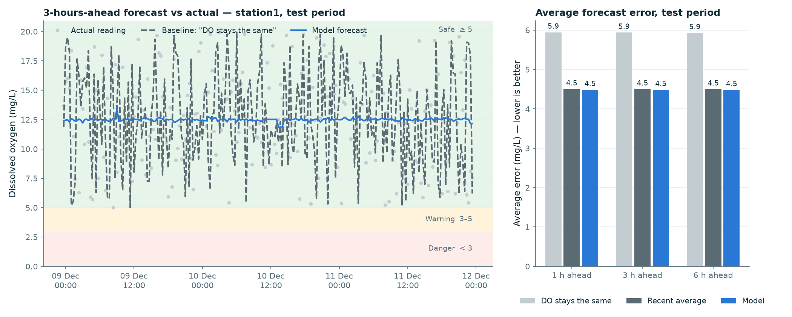

# Dissolved-oxygen forecast — method and results

> **Not shown in the farmer-facing app.** The typical error (±4.5 mg/L) is wider than the whole Warning band (3–5 mg/L), so a forecast value would mislead farmers. This page documents it as an honest experiment. The app shows a simpler ["time until danger"](time_to_danger.md) estimate instead.



## What it does

1. Takes a pond's last 24 hours of sensor readings (every 20 minutes).
2. Predicts dissolved oxygen (DO) **1, 3 and 6 hours ahead** with a scikit-learn model.
3. Passes each predicted DO through the rule-based classifier ([thresholds](thresholds.md)) to get a future **Safe / Warning / Danger** level, with the reason in English and Kannada.

Code: `ml/train_do_forecast.py` (training), `backend/do_features.py` (inputs), `backend/do_forecast.py` (used by the app). Saved model: `models/do_forecast.joblib`.

## How it was tested

- **Data:** Kaggle Pondsdata, `Ponds data.csv`, 3 ponds, Feb 2022 – Jan 2023.
- **Split by time, never shuffled:** train on 1 Feb – 6 Oct 2022 (53,456 rows), choose the model on 7 Oct – 28 Nov (11,410), and test **once** on 29 Nov 2022 – 21 Jan 2023 (9,731), a period the model never saw.
- **Inputs the model sees (all from the past only):** latest DO, average DO over the last 1 / 3 / 6 / 24 h, DO variability over 3 h, average temperature and pH over 3 h, and time of day.
- **Models compared:** linear regression (Ridge) and gradient boosting. Gradient boosting was very slightly better on validation (4.33 vs 4.34 mg/L) and was kept.
- **Baselines:**
  - **"DO stays the same"**: predict that DO in 3 h equals DO now.
  - **"Recent average"**: predict the average of the last few hours. The best window, 24 h, was picked on validation.

## Results on the test period

| Forecast | "DO stays the same" | Recent average (24 h) | **Model** |
|---|---|---|---|
| 1 h ahead — average error | 5.9 mg/L | 4.5 mg/L | **4.5 mg/L** |
| 3 h ahead — average error | 5.9 mg/L | 4.5 mg/L | **4.5 mg/L** |
| 6 h ahead — average error | 5.9 mg/L | 4.5 mg/L | **4.5 mg/L** |
| Real Warning/Danger moments flagged (3 h) | 8.9 % | 0 % | **0 %** |

**In plain words:**
- On average, the model's forecast is **off by about 4.5 mg/L**. "DO stays the same" is off by about 5.9 mg/L, so the model has **about 1.5 mg/L (24%) less error**.
- The model is **no better than averaging the last 24 hours**, and it **did not flag any** of the moments that were really Warning or Danger.
- What the model relies on most is the 24-hour average DO. Scrambling it raises the error the most; the latest single reading adds nothing.

## Why: what the data allows

The dataset limits what any model can do here:

- **No daily oxygen cycle.** Real ponds have one (lowest at dawn, highest in the afternoon). In this data, average DO is about the same at every hour.
- **Readings jump randomly.** DO swings several mg/L between readings 20 minutes apart (e.g. 10.4 → 8.3 → 6.3 → 10.1), which a real pond can't do, so it's sensor noise. The 20-minute-ago reading tells you no more than the reading from 6 hours ago.
- **Low readings are isolated blips.** After a reading below 5 mg/L, the next is also low only 5% of the time (3% by chance). There's no gradual decline to detect.
- **Even perfect knowledge of the daily level doesn't help.** A "cheating" forecaster that knows each future day's *true* average DO is still off by **4.45 mg/L**. The model (4.49) is already at that limit.

**Conclusion:** the forecasting pipeline works and beats the "stays the same" baseline, but this dataset's DO readings are too noisy for short-term early warning. With real pond sensors, which show smooth daily oxygen cycles, the same pipeline can be retrained (`python -m ml.train_do_forecast`) without code changes.

## Experiment: forecasting the 3-hour *average* DO instead

Since single readings are so noisy, we also tried forecasting the **average DO over the next 3 hours** (and over hours 3–6). The pass rule was fixed **before** looking at results: keep it only if it has ≥ 10% less error than the **best** baseline, and isn't worse at flagging unsafe periods.

| Average DO over the next 3 h (test period) | Average error |
|---|---|
| "DO stays the same" | 4.66 mg/L |
| Recent average (24 h) | 1.43 mg/L |
| Model (gradient boosting) | **1.35 mg/L** |
| Best possible (knows each future day's true average) | 1.28 mg/L |

Hours 3–6 gave the same numbers.

**Result: not adopted.** The model has 71% less error than "DO stays the same", but only **5.5% less than a plain 24-hour average**, which is below the 10% bar. The big drop in error (4.5 → 1.35 mg/L) comes from averaging away sensor noise, not from the model. The test period also has **no** 3-hour periods below 5 mg/L, so warning ability can't be measured. The single-reading model above stays in use.

Reproduce: `python -m ml.experiment_3h_average`

## Simulated data is never used here

All accuracy numbers on this page come from the real Pondsdata readings. The demo simulator (`backend/simulator.py`) is used only to drive the app demo. The training code refuses simulated data.

## Reproduce

```bash
python -m ml.train_do_forecast   # trains, prints the report, saves model + metrics + chart
python -m pytest                 # runs all tests
```

Full numbers: `models/do_forecast_metrics.json`.
