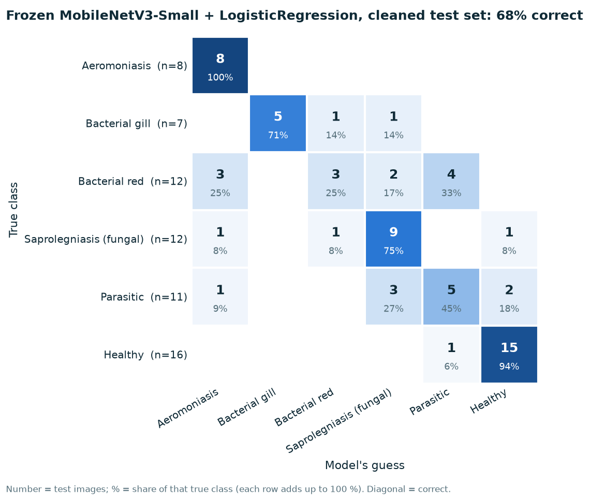

# Fish-disease photos: baseline model

Step 2 of [disease-detection-plan.md](disease-detection-plan.md). Made by `python -m ml.train_fish_disease_baseline`.
Research only. **Nothing here is used by the app.**

## Setup

- Data: the cleaned dataset from [fish-disease-cleaning.md](fish-disease-cleaning.md). 6 classes. Split by photo
  group, so no copy of a test photo is in training. Train 306, validation
  67, **test 66** images.
- Model: MobileNetV3 pre-trained on ImageNet, **frozen** (not retrained), turns each photo into a list of numbers.
  A scikit-learn `LogisticRegression` (with `class_weight="balanced"`, because Healthy is much bigger) learns the
  classes from those numbers.
- C (how strongly the model is kept simple) was chosen on the validation set; the final model was trained on
  train + validation and scored **once** on the test set.
- Ranges in brackets are 95 % bootstrap ranges, resampling whole photo groups. With so few test images per class
  they are wide, and that is the honest picture.

## Results on the cleaned test set

| Model | Accuracy | Balanced accuracy | Macro-F1 |
|---|---:|---:|---:|
| **MobileNetV3-Small** + LogReg (C = 0.01) | 68 % (56–79 %) | 68 % | 66 % (52–75 %) |
| MobileNetV3-Large + LogReg (C = 0.01) | 70 % (58–80 %) | 69 % | 66 % (51–77 %) |
| Always guess *Healthy* | 24 % | 17 % | 7 % |
| Background only (Small, middle 60 % greyed out) | 55 % (42–67 %) | 51 % | 47 % (35–56 %) |
| Original Kaggle split, no cleaning (Small) | 100 % | 100 % | 100 % |

*Balanced accuracy* = the average of the per-class recalls, so every class counts equally.
*Macro-F1* = the average F1 over the 6 classes. Both matter more than plain accuracy here, because the classes
are unbalanced.

### Per class (MobileNetV3-Small)

| Class | Test images | Precision | Recall | F1 |
|---|---:|---:|---:|---:|
| Aeromoniasis | 8 | 62 % | 100 % | 76 % |
| Bacterial gill | 7 | 100 % | 71 % | 83 % |
| Bacterial red | 12 | 60 % | 25 % | 35 % |
| Saprolegniasis (fungal) | 12 | 60 % | 75 % | 67 % |
| Parasitic | 11 | 50 % | 45 % | 48 % |
| Healthy | 16 | 83 % | 94 % | 88 % |

*Precision*: when the model says this class, how often it is right. *Recall*: of the photos that really are this
class, how many it finds.

Most common mistakes: Bacterial red → Parasitic (4); Parasitic → Saprolegniasis (fungal) (3); Bacterial red → Aeromoniasis (3).

## What these numbers mean

- **The original split's 100 % is not real.** On Kaggle's own Train/Test folders the same method
  scores 100 %, because every test image is also a training image. Papers reporting 95–99 % on this
  dataset have the same problem. On the cleaned split the honest number is **68 %**.
- **Background-only score: 55 %.** With the middle of every photo greyed out, the model still
  gets 55 % right, against 68 % with the whole photo and
  24 % for always guessing the biggest class. So a large part of the score comes from the
  background, photo style and species (stock photos of carp = Healthy; aquarium fish and lab close-ups = disease),
  not from disease signs. The border can still show parts of the fish, so this test overstates the shortcut a
  little, but the shortcut is clearly there. The high Healthy score (94 %
  found) is probably mostly this effect.
- **Bigger network, same result.** MobileNetV3-Large is not clearly better than Small
  (70 % vs 68 %; the ranges overlap almost completely). The limit is the
  data, not the network size.
- **Test set is tiny.** 66 images, some classes with fewer than 15. One or two photos change a class's recall
  by 10 percentage points, so per-class numbers are rough.
- **Not tested on Indian carps.** These are mostly goldfish, aquarium fish and stock-photo carp. Results on rohu,
  catla or mrigal in a Karnataka pond will be lower and are unknown.

## Next

Step 3 (fine-tuning MobileNetV3-Small) has **not** been started. Before it, it is worth deciding whether this data
is good enough, given the background shortcut above. Possible fixes: crop every image to the fish, or add a second
dataset with healthy *and* sick fish photographed the same way.
