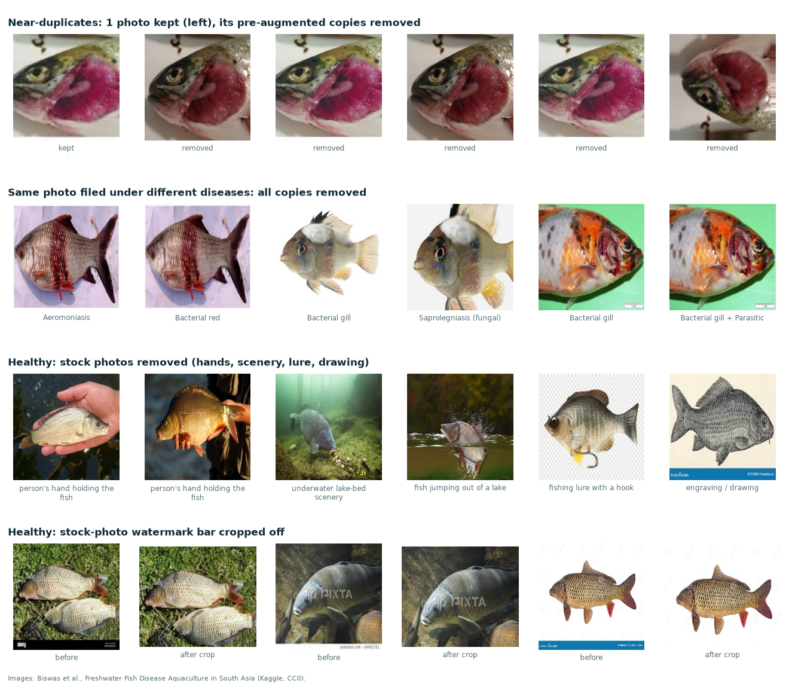

# Fish-disease photos: cleaning report

Step 1 of [disease-detection-plan.md](disease-detection-plan.md). Made by `python -m ml.clean_fish_disease`.
Dataset: Biswas et al., *Freshwater Fish Disease Aquaculture in South Asia* (Kaggle, CC0), dataset #1 in the plan.

## Summary

- **The original Test folder is useless.** 598 of the 598 unique images in `Test/` are exact
  copies of images in `Train/`. A model scored on that split has already seen the test images.
- **Most images are copies.** The 2100 files (6 classes, Train + Test) contain 1497 unique images.
  Each disease photo was saved many times: rotated, zoomed, mirrored or with the edges stretched. Removing those
  copies (and the problem images below) leaves **439 images in only 301 independent photo groups**.
- **"White tail disease" is dropped** (350 files): it is a prawn disease, but the folder holds goldfish and
  other fish. We use 6 classes.
- **Healthy:** 57 stock photos were removed by hand (anglers, hands holding the fish, underwater lake
  scenery, a fishing lure, drawings), plus the copies of those photos; 15 kept photos had a stock-photo
  watermark bar cropped off the bottom.
- **New split:** 70 / 15 / 15 per class, by **photo group**, so every copy or extra shot of the same fish is in only
  one of train, validation or test.

## Counts

| Class | Files (Train + Test) | Unique images | Label conflicts | Healthy review | Near-duplicates | **Kept** | Photo groups | Train / Val / Test |
|---|---:|---:|---:|---:|---:|---:|---:|---|
| Aeromoniasis | 350 | 250 | 5 | – | 189 | **56** | 33 | 39 / 9 / 8 |
| Bacterial gill | 350 | 250 | 24 | – | 181 | **45** | 28 | 31 / 7 / 7 |
| Bacterial red | 350 | 248 | 8 | – | 162 | **78** | 45 | 54 / 12 / 12 |
| Saprolegniasis (fungal) | 350 | 250 | 8 | – | 161 | **81** | 48 | 57 / 12 / 12 |
| Parasitic | 350 | 250 | 8 | – | 169 | **73** | 47 | 51 / 11 / 11 |
| Healthy | 350 | 250 | 0 | 65 | 79 | **106** | 100 | 74 / 16 / 16 |
| **Total** | 2100 | 1498 | 53 | 65 | 941 | **439** | 301 | 306 / 67 / 66 |

*Photo groups* = images linked as copies of the same photo or the same fish. The split keeps each group whole.
Disease classes now have only 45–81 images each, while Healthy has 106.
**The classes are unbalanced and small**; that limits what any model can learn from this data.

## How duplicates were found

1. **Exact duplicates:** images with identical pixels (MD5 hash of the decoded image).
2. **Near-duplicates.** Candidate pairs: each image's 15 most similar images by MobileNetV3-Large features.
   A pair counts as *the same photo* if any of these is true:
   - perceptual hash (also tried mirrored, flipped and rotated) differs by at most 4 of 64 bits; or
   - OpenCV ORB keypoint matching finds at least 60 matching points that agree on one rotation + zoom
     (or 40–59 points and, after lining the images up, a pixel correlation of at least 0.1); or
   - at least 12 such points **and** after lining the two images up, their pixels correlate at least
     0.45. This extra check is needed because the repeating scale pattern of carp fools keypoint matching
     between two *different* carp.
   The thresholds were set by looking at a few hundred pairs by eye. Feature similarity alone was **not** used as a
   rule: different carp on a white background look "very similar" to the network.
3. Linked images form a **photo group** (chains count: if A~B and B~C, all three are one group). In each group the
   biggest image is kept, plus any member that is not a direct copy of a kept one (for example a second shot of the
   same fish); everything else is removed as a near-duplicate.
4. If a group contains images from two classes, the **whole group is removed** (label conflict: the same photo is
   labelled as two different diseases, so we cannot trust either label).

## Healthy class review

Every one of the 250 unique Healthy images was looked at by eye. Decisions are in
[`ml/fish_disease_healthy_review.csv`](../ml/fish_disease_healthy_review.csv) (57 remove, 22 crop).
Removed: people or hands in the picture, fishing gear, underwater or lake scenery where the fish is small,
fishing lures, fish models, drawings and paintings. Cropped: a stock-photo watermark bar along the bottom.
Kept: a single fish filling most of the frame, including fish on grass, ice or a market floor.

## Problems that cleaning does NOT fix

- **Shortcut risk remains.** Healthy photos are mostly *stock photos of carp* on white or plain backgrounds.
  The disease photos are mostly *aquarium fish and goldfish*, often close-ups on lab tables or in hands, with arrows
  and circles drawn on them. A model can partly tell the classes apart by **species, background and photo style**
  instead of by disease signs. Step 2 measures this with a "background only" test.
- **Very few independent disease photos** (28–48 photo groups per disease class). Test-set numbers are based on a few dozen images
  per class, so they are rough.
- **Not Indian carps.** Almost no rohu, catla or mrigal with disease. Results will not transfer directly to Karnataka ponds.

## Files

- Cleaned images: `data/fish-disease/clean/{train,val,test}/<class>/` (not in git; re-create with the command above).
- [`docs/fish-disease-split.csv`](fish-disease-split.csv): every kept image, its split, photo group and original file.
- `data/fish-disease/clean/removed.csv`: every removed image and why.
